<div align="center">



<br><br>

**403 câu hỏi. Hai màn hình. Sáu ngày. Một con mèo.**

*Đây không phải tài liệu kỹ thuật. Đây là kế hoạch qua môn.*

</div>


## Chuyện xảy ra vào một tối thứ Ba

Bạn mở đề cương. 403 câu. Cuộn xuống. Vẫn còn. Cuộn tiếp. Vẫn còn.

Đóng lại. Mở TikTok.

Đó chính xác là lý do repo này tồn tại. Không phải vì đề khó — mà vì **một file 403 câu thì không ai học nổi**. Còn 403 câu chia thành những lần mở điện thoại 4 phút lúc xếp hàng mua trà sữa thì có.


## Sáu ngày, một chiến thuật



<table>
<tr>
<th width="16%">Ngày</th>
<th width="24%">Ở đâu</th>
<th>Làm gì</th>
</tr>

<tr>
<td align="center"><b>1–2</b><br><sub>làm quen</sub></td>
<td>📱 Điện thoại<br><sub>lúc chờ, lúc nằm</sub></td>
<td>Mở đại, làm 30–60 câu. <b>Không cần đúng.</b> Mục tiêu duy nhất: biết đề hỏi kiểu gì. Sai câu nào bấm ★ câu đó rồi lướt tiếp.</td>
</tr>

<tr>
<td align="center"><b>3</b><br><sub>vào guồng</sub></td>
<td>💻 Máy tính<br><sub>ngồi tử tế 1 tiếng</sub></td>
<td>Bật <b>Tự next</b>, chạy 100 câu liền mạch. Cái này giống phòng thi nhất: không có thời gian đắn đo.</td>
</tr>

<tr>
<td align="center"><b>4</b><br><sub>trả nợ</sub></td>
<td>📱 hoặc 💻</td>
<td>Bật lọc <b>★ Câu hỏi đã đánh dấu</b>. Chỉ làm đúng những câu từng sai. Đây là ngày ăn điểm nhiều nhất.</td>
</tr>

<tr>
<td align="center"><b>5</b><br><sub>quét sạch</sub></td>
<td>💻 Máy tính</td>
<td><b>Refresh → Tạo mới &amp; trộn câu</b>. Đề xáo lại từ đầu. Câu nào vẫn sai nghĩa là bạn đang thuộc <i>vị trí đáp án</i> chứ chưa thuộc <i>kiến thức</i>.</td>
</tr>

<tr>
<td align="center"><b>6</b><br><sub>tổng duyệt</sub></td>
<td>💻 Máy tính</td>
<td>Chạy hết 403 câu. Đếm câu sai. Dưới 20 là ngủ ngon được rồi.</td>
</tr>

<tr>
<td align="center"><b>Thi</b></td>
<td>🏫 Phòng thi</td>
<td>Không mở app nữa. Ăn sáng. Đi sớm.</td>
</tr>
</table>


## Ba thứ khiến bạn học được lâu hơn bạn tưởng

<table>
<tr>
<td width="33%" valign="top" align="center">

### 🐱
**Neko**

Một con mèo chạy theo con trỏ. Sai nhiều nó an ủi, đúng liên tiếp nó ăn mừng. Thỉnh thoảng tha về một mảnh giấy ghi keyword.

<sub>Nghe vô nghĩa. Nhưng bạn sẽ học lâu hơn 20 phút chỉ vì không nỡ đóng tab.</sub>

</td>
<td width="33%" valign="top" align="center">

### 👥
**Có người học cùng**

Thanh đầu trang hiện số người **đang mở web ngay lúc này**, số người **học hôm nay**, và **tổng lượt vào**.

<sub>2 giờ sáng thấy con số "Đang học: 4" — tự nhiên thấy đỡ cô đơn hẳn.</sub>

</td>
<td width="33%" valign="top" align="center">

### 💬
**Khung chat**

Gặp câu khó thì ném vào chat. Đặt cho mình một biệt danh, kiểu *Cú Đêm 77*.

<sub>Cãi nhau về một đáp án là cách nhớ nó lâu nhất.</sub>

</td>
</tr>
</table>


## Mẹo nhỏ, ăn điểm thật

> **★ là bạn thân.** Đừng tiếc tay bấm sao. Cuối cùng bạn chỉ cần ôn đúng nhóm câu đó.
>
> **Đừng học theo thứ tự.** Não rất giỏi thuộc lòng thứ tự mà không hiểu gì. Trộn câu là để phá trò đó.
>
> **Sai không sao, sai xong nhớ là được.** Bộ đếm câu sai không phải để phán xét, nó là danh sách việc cần làm.
>
> **Học 4 phút vẫn hơn không học.** Điện thoại mở ra là vào thẳng câu hỏi, không màn hình chờ, không đăng nhập.
>
> **Đêm trước ngày thi thì ngủ.** Câu thứ 403 không cứu được bạn, nhưng thiếu ngủ thì dìm được bạn.


## Trên hai màn hình

<table>
<tr>
<th width="50%">💻 Máy tính — <i>phòng thi mô phỏng</i></th>
<th width="50%">📱 Điện thoại — <i>tranh thủ mọi lúc</i></th>
</tr>
<tr valign="top">
<td>

Sidebar luôn hiện bên trái. Bấm `←` `→` để chuyển câu, `Space` để xác nhận — không cần chạm chuột.

Hợp cho những buổi cày dài, cần nhìn tổng thể tiến độ và mở khung chat song song.

</td>
<td>

Thanh dính trên đỉnh hiện đủ số liệu. Nút **Tiếp theo** dính đáy, ngón cái với tới được.

Còn lại thu hết vào nút **☰** — vì lúc lướt bạn chỉ cần: đọc, chạm, next.

</td>
</tr>
</table>


<details>
<summary><h3>🔧 Sổ tay kỹ thuật <sub>(bấm mở nếu bạn định sửa code)</sub></h3></summary>

<br>

### Chạy thử

```bash
# Chỉ làm bài
python3 -m http.server 8000     # rồi mở http://localhost:8000

# Đầy đủ, có chat và bộ đếm
npm install && npx vercel dev   # cần .env với REDIS_URL=redis://...
```

> Phải chạy qua HTTP server. Double-click thẳng `index.html` sẽ chết ở bước `fetch('./ques.md')`.

### Thêm câu hỏi

Sửa `ques.md`, không đụng code:

```
Lời kêu gọi toàn quốc kháng chiến của Chủ tịch Hồ Chí Minh được phát ra vào thời gian nào?
A. 12-12-1946
B. 22-12-1946
C. 2-3-1946
D. 19-12-1946
@@@D###
```

| Kiểu | Cú pháp |
|:--|:--|
| Chỉ chữ cái | `@@@D###` |
| Ghi đầy đủ | `@@@D. 19-12-1946###` |
| Nhiều đáp án đúng | `@@@A, C###` |
| Kèm giải thích | `@@@D` → xuống dòng ghi giải thích → `###` |
| Tối đa 8 lựa chọn | `A.` đến `H.` |

⚠️ Không đánh số thứ tự đầu câu — app trộn ngẫu nhiên nên số sẽ sai lệch.

### Cấu trúc

```
index.html     Giao diện
app.js         Parse đề · chấm điểm · chat · tìm kiếm · thống kê
styles.css     Style (có khối riêng cho mobile ở cuối file)
neko.js        Mèo Neko
notes_data.js  Dữ liệu tab Note (đang trống)
ques.md        403 câu hỏi
api/chat.js    Chat            (Redis)
api/stats.js   Bộ đếm cộng đồng (Redis)
assets/        Ảnh động của README này
```

### Ba con số được tính thế nào

| Chỉ số | Công thức |
|:--|:--|
| **Đang học** | Mỗi máy ping 5 giây/lần. Server xoá ai im lặng quá 15 giây rồi đếm số còn lại. |
| **Học hôm nay** | HyperLogLog theo ngày (giờ VN, UTC+7) — đếm số `userId` khác nhau, reset lúc 00:00. |
| **Lượt vào** | Bộ đếm cộng dồn, `INCR` một lần cho mỗi tab mở mới. |

Danh tính là `userId` ngẫu nhiên trong `localStorage` → cùng máy cùng trình duyệt tính là một người.

### Deploy

Push lên Vercel (`vercel.json` có sẵn, không cần cấu hình build). Khai báo env `REDIS_URL` hoặc `KV_URL`.
Thiếu Redis thì chat và bộ đếm im lặng, **phần làm bài vẫn chạy bình thường**.

</details>

<div align="center">
<br>

```
 /\_/\     "Sen ơi, còn 21 câu nữa thôi."
( o.o )
 > ^ <     — Neko, 2 giờ sáng
```

<br>

<sub>Chúc qua môn. Và nếu được điểm cao, nhớ là do bạn học chứ không phải do con mèo.</sub>

</div>
