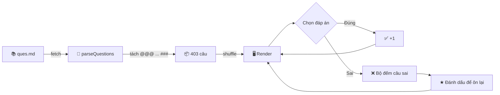

<div align="center">

```
██╗   ██╗███╗   ██╗██████╗ ██████╗  ██████╗ ██████╗
██║   ██║████╗  ██║██╔══██╗╚════██╗██╔═████╗╚════██╗
██║   ██║██╔██╗ ██║██████╔╝ █████╔╝██║██╔██║ █████╔╝
╚██╗ ██╔╝██║╚██╗██║██╔══██╗██╔═══╝ ████╔╝██║██╔═══╝
 ╚████╔╝ ██║ ╚████║██║  ██║███████╗╚██████╔╝███████╗
  ╚═══╝  ╚═╝  ╚═══╝╚═╝  ╚═╝╚══════╝ ╚═════╝ ╚══════╝
```

### 🇻🇳 Lịch sử Đảng Cộng sản Việt Nam — Luyện đề online

*Học một mình thì buồn, học với con mèo chạy quanh màn hình thì đỡ hơn.*

<br>


<br>

```
   ┌──────────────────────────────────────────────────────┐
   │  ★  403 câu     ⚡ Trộn ngẫu nhiên     💬 Chat nhóm  │
   │  🔍 Tìm kiếm    ↺ Làm lại từng câu     🐱 Neko       │
   └──────────────────────────────────────────────────────┘
```

</div>

---

## 🎯 Cái này là gì?

Một trang web trắc nghiệm **một file HTML, không framework, không build step**.
Mở lên là làm bài. Ngân hàng đề nằm trong `ques.md` — muốn thêm câu thì gõ vào file text, xong.

<table>
<tr>
<td width="50%" valign="top">

**Làm bài**
- Trộn ngẫu nhiên câu + đáp án
- Chấm ngay, hiện đáp án đúng
- ↺ Làm lại riêng từng câu
- ⚡ Chế độ *Tự next*

</td>
<td width="50%" valign="top">

**Ôn có chiến thuật**
- ★ Đánh dấu câu hay sai
- Lọc *chỉ xem câu đã đánh dấu*
- Bộ đếm câu sai realtime
- 🔍 Tìm kiếm cả ngân hàng đề

</td>
</tr>
<tr>
<td valign="top">

**Học cùng nhau**
- 💬 Chat thảo luận + emoji + ảnh
- Đếm số người đang online học

</td>
<td valign="top">

**Vui là chính**
- 🐱 Mèo Neko chạy theo chuột
- Tab Note tra keyword nhanh

</td>
</tr>
</table>

---

## 🗺️ Bản đồ project

```
VNR202_FE/
│
├── 🏠 index.html ········· giao diện chính
├── 🧠 app.js ············· parse đề · chấm điểm · chat · tìm kiếm
├── 🎨 styles.css ········· toàn bộ style
├── 🐱 neko.js ············ mèo chạy theo con trỏ
├── 📒 notes_data.js ······ dữ liệu tab Note (đang trống)
├── 📚 ques.md ············ ⭐ NGÂN HÀNG ĐỀ — sửa ở đây
│
├── 🔌 api/
│   ├── chat.js ·········· serverless chat  (Redis)
│   └── stats.js ········· đếm người online (Redis)
│
└── 📦 resource/
    ├── emoji.json
    └── oneko.gif
```

---

## ⚙️ Luồng chạy



---

## ✍️ Cách thêm câu hỏi

Chỉ cần sửa `ques.md`. Không đụng vào code.

```
Lời kêu gọi toàn quốc kháng chiến của Chủ tịch Hồ Chí Minh được phát ra vào thời gian nào?
A. 12-12-1946
B. 22-12-1946
C. 2-3-1946
D. 19-12-1946
@@@D###
```

> **Công thức:** `đề bài` → `các lựa chọn A→H` → `@@@đáp án###`

<details>
<summary><b>📐 Các biến thể khác (bấm để xem)</b></summary>

<br>

| Kiểu | Cú pháp | Ghi chú |
|:--|:--|:--|
| Chỉ chữ cái | `@@@D###` | Gọn nhất, khuyên dùng |
| Ghi đầy đủ | `@@@D. 19-12-1946###` | Cũng chạy được |
| Nhiều đáp án | `@@@A, C###` | Phải chọn đủ mới tính đúng |
| Có giải thích | `@@@D`<br>`Ngày 19/12/1946...`<br>`###` | Dòng 2 trở đi là giải thích |
| Tới 8 lựa chọn | `A.` → `H.` | Đề có A–E vẫn parse bình thường |

⚠️ **Không** đánh số thứ tự đầu câu (`1.`, `2.`) — app trộn ngẫu nhiên nên số sẽ sai lệch.

</details>

---

## 🚀 Chạy thử

<table>
<tr><th width="50%">Chỉ làm bài</th><th width="50%">Đầy đủ (có chat)</th></tr>
<tr>
<td valign="top">

```bash
python3 -m http.server 8000
```
→ mở `http://localhost:8000`

Không cần cài gì thêm.

</td>
<td valign="top">

```bash
npm install
npx vercel dev
```
Cần `.env`:
```
REDIS_URL=redis://...
```

</td>
</tr>
</table>

> ⚠️ Phải chạy qua HTTP server. Double-click thẳng `index.html` sẽ **chết** ở bước `fetch('./ques.md')`.

---

## ☁️ Deploy

Push lên Vercel là xong — `vercel.json` có sẵn, không cần cấu hình build.

| Bước | Việc cần làm |
|:-:|:--|
| 1️⃣ | Import repo vào Vercel |
| 2️⃣ | Thêm env `REDIS_URL` (hoặc `KV_URL`) |
| 3️⃣ | Deploy |

> Không có Redis thì chat và bộ đếm online sẽ im lặng — **phần làm bài vẫn chạy bình thường**.

---

## 📊 Thống kê ngân hàng đề

```
Tổng:  403 câu

A  ████████████████████████████████████  146   36.2%
B  ███████████████████████               92    22.8%
D  █████████████████████                 87    21.6%
C  ███████████████████                   78    19.4%
```

> Đáp án **A** hơi nhiều... nhưng đừng khoanh bừa A. 😉

---

## 📌 Ghi chú

- Tab **Note** đang trống (`notes_data.js = []`). Muốn dùng thì điền `window.notesData`
  theo cấu trúc `section` → `subsection` → `notes` / `warning`.
- Toàn bộ nội dung học thuật của repo nằm gọn trong `ques.md`. Không có file tài liệu nào khác.

<div align="center">
<br>

```
 /\_/\     Chúc ôn thi thuận lợi.
( o.o )    Sai nhiều không sao — sai xong nhớ là được.
 > ^ <
```

</div>
